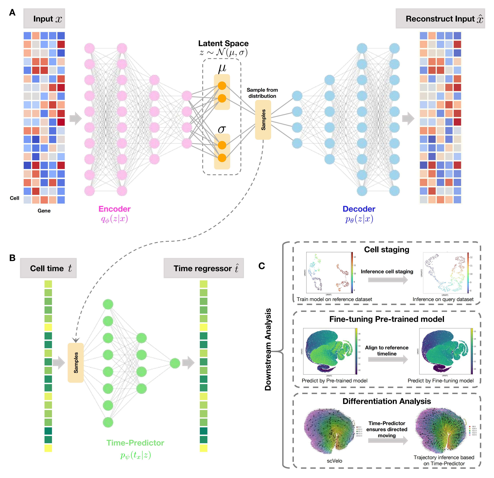

# TemporalVAE: atlas-assisted temporal mapping of time-series single-cell transcriptomes during embryogenesis

[](https://opensource.org/license/mit/)

Contact: Yuanhua Huang, Yijun Liu

Email:  yuanhua@hku.hk

## Introduction

TemporalVAE is a deep generative model in a dual-objective setting to infer the biological time of cells from a compressed latent space.
We demonstrated its scalability to millions of cells in the mouse development atlas and its high accuracy in atlas-based cell staging on mouse organogenesis across platforms and
during human peri-implantation between in vivo and in vitro conditions.
Furthermore, we showed that our atlas-based time predictor can effectively support RNA velocity modeling over short-time cell differentiation, including hematopoiesis and neuronal
development.

A preprint describing TemporalVAE's algorithms and results is at [bioRxiv](https://;.



---

## Contents

- [Latest Updates](#latest-updates)
- [Installations](#installation)
- [Reproduce the result in manuscript](#Reproduce the result in manuscript)

## Latest Updates

* v0.1 (May, 2025): Initial release.

---

## Installation

To install TemporalVAE, python 3.9 is required and follow the instruction

1. Install <a href="https://docs.conda.io/projects/miniconda/en/latest/" target="_blank">Miniconda3</a> if not already available.
2. Clone this repository:

```bash
  git clone https://github.com/StatBiomed/TemporalVAE
```

3. Navigate to `TemporalVAE` directory:

```bash
  cd TemporalVAE
```

4. (5-10 minutes) Create a conda environment with the required dependencies:

```bash
  conda env create -f environment.yml
```

5. Activate the `TemporalVAE` environment you just created:

```bash
  conda activate TemporalVAE
```

6. Install **pytorch**: You may refer to [pytorch installtion](https://pytorch.org/get-started/locally/) as needed. For example, the command of installing a **cpu-only** pytorch
   is:

```bash
conda install pytorch torchvision torchaudio cpuonly -c pytorch
```

---

## Reproduce the result in manuscript

The code is in folder named by figure-index

### Figure 2: Compare the TemporalVAE with baseline methods in three small datasets cited in Psupertime mansucript

### Figure 3:

1. Preprocess the mouse atlas data and mouse stereo data by

```bash
python -u Fig3_mouse_data/preprocess_data_mouse_embryonic_development_combineData.py
python -u Fig3_mouse_data/preprocess_data_mouse_embryo_stereo.py
```

2. 2 Reproduce the result of **Figure3.A&B** and save results in folder _results/230827_trainOn_mouse_embryonic_development_kFold_testOnYZdata0809_

```bash
python -u Fig3_mouse_data/VAE_mouse_kFoldOn_mouseAtlas.py 
--result_save_path=230827_trainOn_mouse_embryonic_development_kFold_testOnYZdata0809
--vae_param_file=supervise_vae_regressionclfdecoder_mouse_stereo
--file_path=/mouse_embryonic_development/preprocess_adata_JAX_dataset_combine_minGene100_minCell50_hvg1000 
--time_standard_type=embryoneg5to5
--train_epoch_num=100  --kfold_test --train_whole_model
> logs/log.log
```

2. 2 Plot **Figure3.A&B** with the result in _results/230827_trainOn_mouse_embryonic_development_kFold_testOnYZdata0809_, please check _Fig3_mouse_data/plot_figure3AB.ipynb_

2. 3 **Figure3.C**: Compare TemporalVAE with LR, PCA, RF on mouse atlas data, please check _Fig3_mouse_data/LR_PCA_RF_kFoldOn_mouseAtlas.ipynb_

3. **Figure3.D&E**: Models train on mouse atlas data and predict on mouse stereo-seq data, please check _Fig3_mouse_data/TemporalVAE_LR_PCA_RF_directlyPredictOn_mouseStereo.ipynb_
   or run code _Fig3_mouse_data/TemporalVAE_LR_PCA_RF_directlyPredictOn_mouseStereo.py_ on console.

### Figure 4:

1. Preprocess the raw dataset by

```bash
python -u Fig4_human_data/preprocess_humanEmbryo_xiang2019data.py
python -u Fig4_human_data/preprocess_humanEmbryo_PLOS.py
python -u Fig4_human_data/preprocess_humanEmbryo_CS7_Tyser.py
```

2. **Figure 4.A**: K-fold test on xiang19 dataset, please check _Fig4_human_data/vae_humanEmbryo_xiang19.ipynb_ or run code on console:

```bash
python -u Fig4_human_data/vae_humanEmbryo_xiang19.py --file_path=/240322Human_embryo/xiang2019/hvg500/
```

3. **Figure 4.B**: Temporal trained on xiang19 dataset and predict on Lv19 dataset, please check _Fig4_human_data/LR_PCA_RF_directlyPredictOn_humanEmbryo_PLOS.ipynb_ or run code
   _Fig4_human_data/LR_PCA_RF_directlyPredictOn_humanEmbryo_PLOS.py_ on console.
4. **Figure 4C&D**: train on 4 in vitro dataset and predict on one in vivo dataset, please check _Fig4_human_data/vae_humanEmbryo_Melania.ipynb_ or run code on console:

```bash
python -u Fig4_human_data/vae_humanEmbryo_Melania.py --file_path=/240405_preimplantation_Melania/
```

### Figure 5:
1. The data is from paper <Systematic reconstruction of the cellular trajectories of mammalian embryogenesis.>.
2. 1 **Figure 5. C&E** is the data of hematopoiesis cells, please check _Fig5_RNA_velocity/VAE_mouse_fineTune_Train_on_U_pairs_S_hematopoiesis.ipynb_ or run code on console:
```bash
python -u Fig5_RNA_velocity/VAE_mouse_fineTune_Train_on_U_pairs_S.py --sc_file_name=240108mouse_embryogenesis/hematopoiesis --clf_weight=0.2
```
2. 2 **Figure 5. D&F** is the data of neuron cells, please check _Fig5_RNA_velocity/VAE_mouse_fineTune_Train_on_U_pairs_S_neuron.ipynb_ or run code on console:
```bash
python -u Fig5_RNA_velocity/VAE_mouse_fineTune_Train_on_U_pairs_S.py --sc_file_name=240108mouse_embryogenesis/neuron --clf_weight=0.1
```
3. The scVelo result in **Figure 5. E&F** is base on the _.ipynb_ code provided by the dataset's paper, please check _Fig5_RNA_velocity/scVelo_hematopoiesis.ipynb_ and _Fig5_RNA_velocity/scVelo_neuron.ipynb_

## Todo

[//]: # (Build a well-structured software packages)


