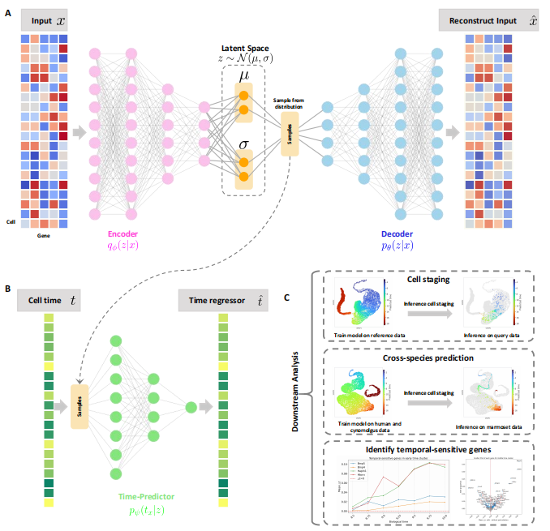

.. Todo |PyPI| |PyPIDownloads| |Docs|
.. TemporalVAE documentation master file, created by
   sphinx-quickstart on Sat May 24 23:03:14 2025.
   You can adapt this file completely to your liking, but it should at least
   contain the root `toctree` directive.

TemporalVAE: atlas-assisted temporal mapping of time-series single-cell transcriptomes during embryogenesis
=========================

.. include:: _key_contributors.rst

**TemporalVAE** is a scalable toolkit for time-series single-cell transcriptomes analysis;
Time-series single-cell transcriptomes analysis enables cell staging predcition, temporally sensitive genes identification by in silico perturbation.

TemporalVAE's key applications
^^^^^^^^^^^^^^^^^^^^^^^^^^^^^^
- cell staging.
- cross-species prediction.
- temporal-sensitive gene identification.

Support
^^^^^^^
Found a bug or would like to see a feature implemented? Feel free to submit an
`issue <https://github.com/StatBiomed/TemporalVAE-release/issues>`_.
.. Todo Have a question or would like to start a new discussion? Head over to
`GitHub discussions <https://github.com/StatBiomed/TemporalVAE-release/discussions>`_.

Your help to improve TemporalVAE is highly appreciated.

.. toctree::
   :caption: Main
   :maxdepth: 1
   :hidden:

   about
   installation
   api
   release_notes
   references

.. toctree::
   :caption: Tutorials
   :maxdepth: 1
   :hidden:

   getting_started
..   VelocityBasics
   DynamicalModeling
   DifferentialKinetics
   vignettes/index

.. automodule:: rest_server.views.basic   # model类.py文件
   :members:

